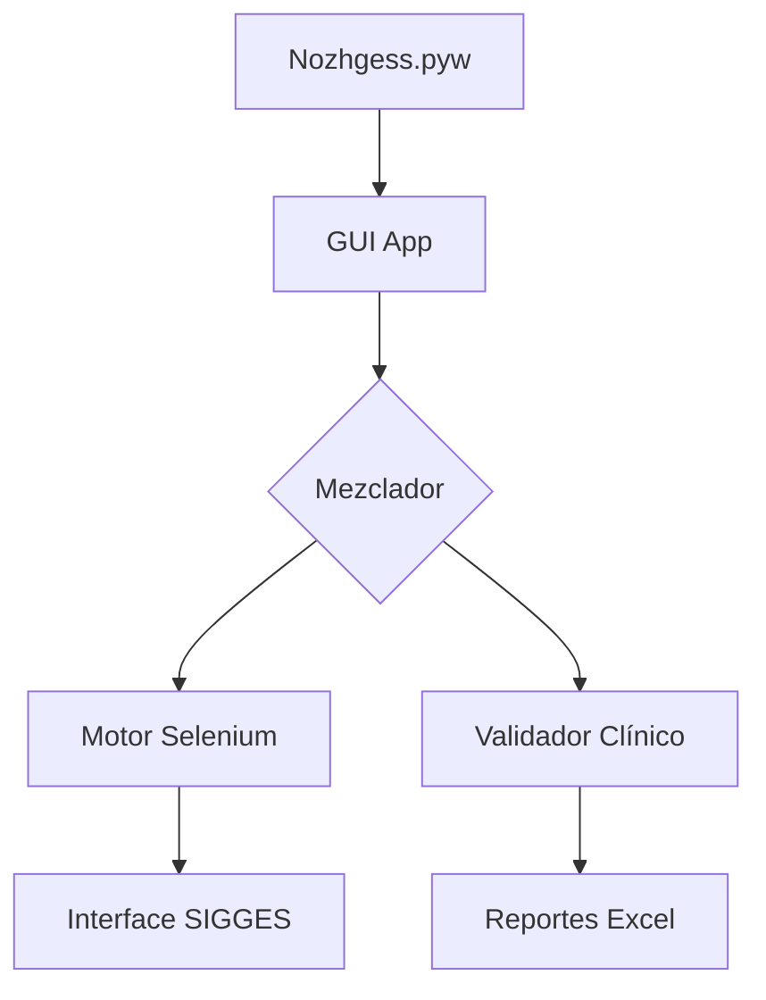

# 🏗️ Arquitectura y Guía de Desarrollo

Este documento está dirigido a desarrolladores que deseen comprender las entrañas de Nozhgess o contribuir a su código base.

---

## 📐 Diseño del Sistema

Nozhgess utiliza una arquitectura desacoplada basada en el patrón de **Servicios y Orquestación**.

### Diagrama de Flujo Lógico

---

## 📂 Organización de Código (`App/src`)

*   **`gui/`**: Contiene la lógica de CustomTkinter. Cada vista es un módulo independiente para facilitar el mantenimiento.
*   **`core/`**: El motor principal.
    *   `Driver.py`: Un wrapper de alto nivel sobre Selenium con reintentos inteligentes.
    *   `States.py`: Máquina de estados para rastrear en qué parte de SIGGES se encuentra el robot.
*   **`utils/`**: Herramientas transversales (Logging, Validaciones RUT, Gestión de Configuración).

---

## ⚡ Sistemas de Resiliencia (NASA Luxury)

Nozhgess implementa técnicas avanzadas para evitar fallos catastróficos:

### 1. Smart Waits (Espera Inteligente)
En lugar de esperas fijas (`time.sleep`), Nozhgess monitorea la estabilidad del DOM y la red para saber exactamente cuándo un elemento es interactuable.

### 2. Circuit Breaker (Corta-Fuego)
Si el sistema detecta 3 fallos consecutivos en la carga de SIGGES, el motor se pone en "Modo de Espera Protagonista", deteniendo la ejecución durante 30 segundos antes de intentar una reconexión limpia, evitando saturar el servidor médico.

### 3. Validación de Contrato en Tiempo Real
Antes de cada interacción crítica, el código verifica si la estructura de la página web sigue coincidiendo con los selectores esperados. Si hay un cambio (Drift), se genera un log de advertencia inmediato.

---

## 🛠️ Contribuir y Extender

1.  **Añadir Nuevos Selectores**: Editar `App/src/core/selectors.py`.
2.  **Modificar Temas**: Personalizar los diccionarios en `App/src/gui/theme.py`.
3.  **Nuevas Misiones**: Implementar una nueva clase que herede del Orquestador base en `App/src/core/Missions.py`.

---
© 2026 Nozhgess Team.
