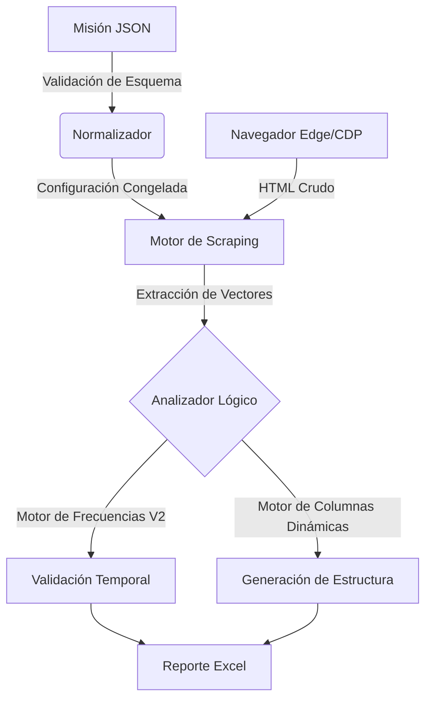

# Biblia Técnica: Arquitectura y Lógica Profunda de Nozhgess (v3.5.1)

> **Advertencia de Seguridad:** Este documento detalla la lógica interna de nivel forense. El conocimiento de estos sub-sistemas es obligatorio para cualquier modificación en el núcleo (`core`).

---

## 1. Arquitectura de Sistemas
Nozhgess opera bajo un modelo **Híbrido MVC/Microservicios Embebidos**.

### 1.1 Diagrama de Flujo de Datos
El flujo de datos ("The Pipeline") es estrictamente unidireccional para garantizar la integridad forense:

### 1.2 Componentes Críticos

#### A. Motor de Scraping (Session Parasitism)
- **Archivo:** `Utilidades/Mezclador/Conexiones.py`
- **Tecnología:** Selenium con Debugging Port (9222)
- **Función:** Se conecta a una sesión de Edge ya autenticada. No realiza login. Utiliza esperas explícitas con backoff exponencial.
- **Protocolo de Fallo:** Si detecta desconexión, lanza `FatalConnectionError` que detiene el hilo de trabajo pero mantiene viva la GUI.

#### B. Motor de Columnas Dinámicas (Dynamic Column Engine)
- **Implementación (v3.5.1):** 
    - Ya no existen columnas estáticas como `Objetivo_1`, `Habilitante_1`.
    - **Lógica de Generación:** Al inicio de cada misión, el sistema lee la configuración (`codigos_objetivo`) y pre-calcula los headers exactos: `Obj [Code]`, `Hab [Code]`, `Excl [Code]`.
    - **Ventaja Forense:** Elimina la ambigüedad de columnas vacías. Si una columna existe, es porque el código fue auditado.

#### C. Validador de Frecuencias V2 (Frequency Validator)
- **Archivo:** `App/src/core/Analisis_Misiones.py`
- **Lógica:** Desacoplado de la visualización. Opera sobre el raw dataset de prestaciones.
- **Algoritmo:**
    1. Normaliza fecha de nómina y fecha de prestación.
    2. Calcula delta temporal (Meses/Años) exacto.
    3. Compara contra `freq_qty` configurado en la misión.
    4. **Resultado:** Booleano de cumplimiento + Metadata para el Excel (Color).

---

## 2. Lógica Forense (The Forensic Core)

### 2.1 Preservación de Evidencia ("Fallecido")
- **Antes (v3.0):** Booleano (Sí/No).
- **Ahora (v3.5.1):** `datetime` exacto.
- **Razón:** En auditoría, saber *cuándo* falleció el paciente es vital para determinar si una garantía venció antes o después del deceso. El sistema extrae este dato directamente de la ficha histórica de SIGGES.

### 2.2 Columna de Observación Limpia
- **Regla:** El sistema no debe "ensuciar" la columna de observaciones con logs automáticos.
- **Excepción:** Solo se escribe si ocurre un **Fallo Técnico Crítico** (ej. "Sin Mini-Tabla", "Timeout Cartola").
- **Uso:** Reservada para notas humanas cualitativas.

### 2.3 Lógica de "Habilitante Vigente" (Hab Vi)
- **Independencia:** Esta columna es calculada independientemente de si los habilitantes se muestran o no.
- **Cálculo:** `(Fecha_Prestación + Ventana_Vigencia) >= Fecha_Corte`.
- **Salida:** "Vigente" / "No Vigente". Es el semáforo principal para determinar si un paciente cumple los pre-requisitos de la misión.

---

## 3. Estándares de Código y Datos

### 3.1 Formato de Fechas
- **Estándar:** `dd-mm-yyyy` (ISO-Latam).
- **Justificación:** Evita confusión mes/día en Excel (formato US vs UK).
- **Implementación:** Forzado en `output_formatter` antes de escribir en Excel.

### 3.2 Manejo de Errores (Error Handling)
- **Nivel 1 (Warning):** Dato faltante no crítico (ej. Edad). Se loguea y continúa.
- **Nivel 2 (Error):** Fallo de scraping en un paciente. Se reintenta 3 veces. Si falla, se marca "Sin Caso" y continúa.
- **Nivel 3 (Fatal):** Caída del navegador. Se aborta la misión y se alerta al usuario.

---
**© 2026 Nozhgess Dept. de Ingeniería**
