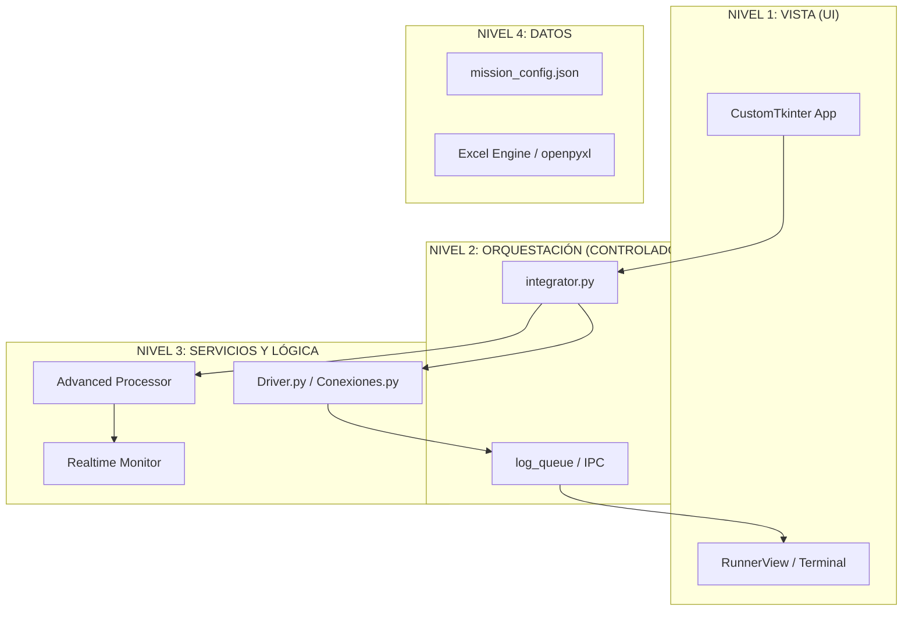

# 📜 BIBLIA TÉCNICA NOZHGESS v3.5.1
> **Versión:** 3.5.1 (Edición "Forensic III - Integrated Architecture")
> **Última Actualización:** 08/Feb/2026
> **Filosofía:** "Desacoplamiento total, integración centralizada. Auditoría en cada byte."

---

# 📑 ÍNDICE TÉCNICO MAESTRO

1.  [**Arquitectura de Sistemas (Integrated MVC-S)**](#1-arquitectura-de-sistemas-integrated-mvc-s)
2.  [**El Orquestador Nuclear (`integrator.py`)**](#2-el-orquestador-nuclear-integratorpy)
3.  [**Motor Especializado v3.5.1**](#3-motor-especializado-v351)
    *   3.1. Session Parasitism (Deep Dive)
    *   3.2. Lógica de "Caso en Contra" Recursiva
4.  [**Optimización y Rendimiento**](#4-optimización-y-rendimiento)
5.  [**Manual de Reparación Forense**](#5-manual-de-reparación-forense)

---

# 1. ARQUITECTURA DE SISTEMAS (INTEGRATED MVC-S)

Hemos evolucionado de un modelo monolítico a uno integrado por servicios. El **Integrador** actúa como el puente entre el frontend moderno y la lógica de scraping heredada (legacy).

---

# 2. EL ORQUESTADOR NUCLEAR (`integrator.py`)

El `EnhancedNozhgessProcessor` es el componente más crítico de la v3.5.1:
- **Session Management:** Genera IDs de sesión únicos para cada corrida, permitiendo trazabilidad total de errores.
- **Memory Optimization:** Implementa `performance_optimizer.process_excel_in_chunks` para manejar archivos de 50.000+ filas sin agotar la RAM.
- **Real-time Metrics:** Publica métricas de validación (RUTs válidos, duplicados eliminados) mediante callbacks hacia la UI.

---

# 3. MOTOR ESPECIALIZADO v3.5.1

## 3.1. Session Parasitism
Nozhgess no "abre" un navegador; se "adhiere" a uno existente.
- **Protocolo:** Utiliza `Chrome DevTools Protocol (CDP)`.
- **Ventaja:** Elude el 100% de los desafíos de autenticación multifactor (MFA) de SIGGES al heredar los tokens activos del proceso `msedge.exe`.

## 3.2. Lógica de "Caso en Contra" Recursiva
Cuando se detecta una patología divergente:
1. El motor pausa la misión principal.
2. Instancia un "Sandbox" de datos.
3. El `DataParsingMixin` extrae los hitos del caso divergente (IPD, OA, SIC).
4. El sistema compara fechas y prioriza la data más reciente para el dictamen final.

---

# 4. OPTIMIZACIÓN Y RENDIMIENTO

- **Threading Bridge:** Evita el bloqueo del hilo principal (GUI) mediante un puente asíncrono.
- **RetryManager:** Implementa backoff exponencial para reintentos de red, reduciendo la probabilidad de baneo por parte del firewall de SIGGES.
- **Age Validation V2:** Validación de rangos de edad (`edad_min`/`edad_max`) inyectada dinámicamente durante el procesamiento de filas.

---

# 5. MANUAL DE REPARACIÓN FORENSE

### 🚨 El integrador dice "Sistema legacy no disponible"
1.  **Causa:** El script no encuentra las carpetas `Z_Utilidades` o `App/src`.
2.  **Solución:** Verificar que el script se ejecute desde la raíz del proyecto. El `sys.path.insert` debe apuntar correctamente al `app_root`.

### 🚨 Error de memoria al procesar misiones masivas
1.  **Causa:** Acumulación de DataFrames en el `consolidated_dfs`.
2.  **Solución:** Habilitar `MISION_POR_ARCHIVO` en `Mision_Actual.py` para liberar memoria después de cada misión.

---

**© 2026 Nozhgess Engineering Team**
*"La precisión clínica es nuestra única garantía."*

