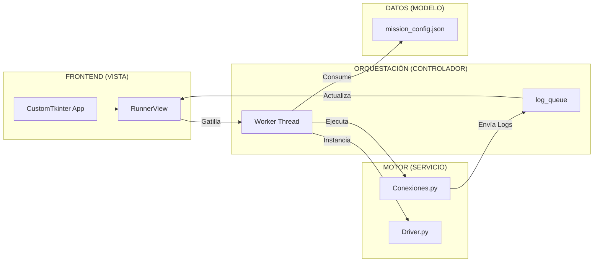
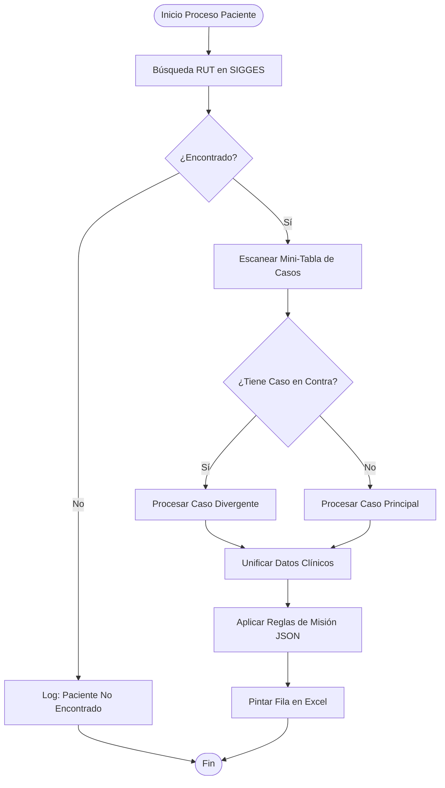

# 📜 BIBLIA TÉCNICA NOZHGESS v3.5.0
> **Versión:** 3.5.0 (Edición "Forensic II - Hyper-Detailed")
> **Última Actualización:** 05/Feb/2026
> **Filosofía:** "Si no está documentado, no es robusto. Cada línea de código debe tener un porqué evidenciable."

---

# 📑 ÍNDICE TÉCNICO MAESTRO

1.  [**Filosofía y Principios de Diseño**](#1-filosofía-y-principios-de-diseño)
2.  [**Arquitectura de Sistemas (MVC-S Deep Dive)**](#2-arquitectura-de-sistemas-mvc-s-deep-dive)
3.  [**El Motor Nuclear (Analysis Engine v3.5)**](#3-el-motor-nuclear-analysis-engine-v3-5)
    *   3.1. Flujo de Decisión Clínica (Mermaid)
    *   3.2. Lógica de "Caso en Contra" y Recursión Controlada
    *   3.3. Validador de Frecuencias V2 (Algoritmos)
4.  [**Concurrencia y Gestión de Hilos (Threading)**](#4-concurrencia-y-gestión-de-hilos-threading)
    *   4.1. El Puente de Mensajería (Queue-Based IPC)
    *   4.2. Prevención de Congelamiento (GUI Responsiveness)
5.  [**Manual de Reparación de Emergencia (Nivel 3)**](#5-manual-de-reparación-de-emergencia-nivel-3)

---

# 1. FILOSOFÍA Y PRINCIPIOS DE DISEÑO

Nozhgess no es un simple script; es un autómata clínico de alta precisión. Su diseño se basa en tres pilares:

- **Robustez sobre Velocidad:** Preferimos tardar 10 minutos más que entregar un dato falso.
- **Evidencia Tangible:** Cada celda del Excel debe poder rastrearse hasta una línea del log forense.
- **Normalización Estricta:** El sistema autolimpia datos basura (espacios, caracteres extraños en RUTs, formatos de fecha inválidos).

---

# 2. ARQUITECTURA DE SISTEMAS (MVC-S DEEP DIVE)

El desacoplamiento es total. Si la web SIGGES cambia, solo debería tocarse el **Modelo** o el **Servicio**, nunca la **Vista**.

---

# 3. EL MOTOR NUCLEAR (ANALYSIS ENGINE v3.5)

## 3.1. Flujo de Decisión Clínica
El motor sigue un árbol de decisión estricto para cada paciente:

## 3.2. Lógica de "Caso en Contra"
Incorporado para detectar pacientes mal ingresados (ej. tipo 1 en nómina de tipo 2).
- **Aislamiento:** El motor extrae los datos del caso divergente en un "sandbox" temporal.
- **Priorización:** Si el caso en contra es el que tiene la data clínica vigente, el sistema lo indica en el Excel marcando "Apto Caso" con la causa encontrada.

## 3.3. Validador de Frecuencias V2
Ubicado en `Analisis_Misiones.py`.
- **Cálculo de Meses:** Utiliza un diferencial Delta entre la Apertura del caso y el último examen registrado.
- **Inyección por Edad:** Si el paciente cumple X años, el motor cambia automáticamente el código de búsqueda basándose en `anios_codigo`.

---

# 4. CONCURRENCIA Y GESTIÓN DE HILOS (THREADING)

## 4.1. El Puente de Mensajería (Queue-Based IPC)
Para evitar que la interfaz muera durante el scraping:
- **`log_queue`**: Una cola thread-safe que recibe diccionarios `{"msg": "...", "lvl": "..."}`.
- **`_drain_ui_queue`**: Función en el hilo principal que corre cada 100ms. Si hay mensajes en la cola, los renderiza en la consola.

## 4.2. Prevención de Congelamiento
El motor Selenium (`Driver.py`) nunca hace llamadas bloqueantes en el hilo principal. Si hay excesiva demora en la red, el sistema dispara un `TimeoutException` que es capturado por el controlador para mantener la UI viva.

---

# 5. MANUAL DE REPARACIÓN DE EMERGENCIA (NIVEL 3)

### 🚨 El robot se detiene sin mensaje de error
1.  **Causa:** El hilo trabajador murió por una excepción no capturada (ej. nulo al parsear fecha).
2.  **Reparación:** Ver `Logs/latest.log`. Si el error es `AttributeError: 'NoneType'`, revise `Formatos.py` y asegúrese de que las fechas tengan un fallback `datetime.min`.

### 🚨 La consola de logs no se mueve (Autoscroll fallido)
1.  **Causa:** El usuario movió la rueda del mouse hacia arriba. El sistema pausa el autoscroll para permitir lectura.
2.  **Reparación:** Baje el scroll manualmente hasta el final y el autoscroll se reactivará automáticamente.

### 🚨 El Excel sale con columnas "fantasmas" (Viejas)
1.  **Causa:** No se cerró el Excel previo o la caché de `Conexiones.py` no se limpió.
2.  **Reparación:** Cierre todos los procesos `Excel.exe` en el Administrador de Tareas.

---

**© 2026 Nozhgess Engineering Team**
*"La precisión clínica es nuestra única garantía."*
