# 📟 Sistema de Logs y Terminales v2.0 - Guía Técnica

Este documento detalla la arquitectura del sistema de logs "Multi-Terminal" implementado en `runner.py` y `Terminal.py`. Este sistema es crítico para la observabilidad del robot y separa la información según el tipo de usuario.

---

## 📐 Arquitectura General

El sistema opera con **3 flujos de datos independientes** que convergen en la interfaz gráfica (GUI):

```mermaid
graph TD
    A[Script: prints stdout] -->|Queue| B[_poll_logs]
    C[Logging: file write] -->|GuiLogHandler| B
    
    B -->|Filtro: Emojis Resumen| D[🟦 Terminal Principal]
    B -->|Filtro: Trazas Debug| E[🟨 Terminal Debug]
    B -->|Filtro: Nivel FILE| F[⬜ Terminal General]
```



---

## 🛠️ Componentes Clave

### 1. `GuiLogHandler` (En `runner.py`)
Clase personalizada que hereda de `logging.Handler`.
*   **Función**: Captura todo lo que se escribe en el archivo `.log` (vía `logging.info()`) y lo envía a la cola de la GUI con un nivel especial etiquetado como `"FILE"`.
*   **Propósito**: Alimentar la pestaña **"General"** para que sea un espejo exacto del archivo de texto.

### 2. `_poll_logs` (En `runner.py`)
El cerebro del ruteo. Lee la cola `log_queue` y decide a qué caja de texto va cada mensaje.

#### Lógica de Ruteo:

| Origen | Condición | Destino | Propósito |
| :--- | :--- | :--- | :--- |
| Origen | Condición | Destino | Propósito |
| :--- | :--- | :--- | :--- |
| **Logging** | `level == "FILE"` | **General** | Ver el log técnico completo (System/Errors). |
| **Stdout** | `🔥`, `📊`, `📋`, `🤹🏻` | **Principal** | Resumen limpio del negocio (Paciente/Misión). |
| **Stdout** | `[DEBUG]`, `⏱️`, `└─`, `🔍` | **Debug** | Tiempos, pasos detallados y trazas del driver. |

> **Nota**: El sistema asegura EXCLUSIÓn MUTUA en la mayoría de los casos. Lo que va a "Terminal" no va a "Debug" para evitar ruido visual, salvo excepciones controladas.

---

## ⚠️ Puntos Críticos de Mantenimiento

Si el sistema de logs falla, revisa estos puntos comunes:

### 1. Error: `NameError: name 'logging' is not defined`
*   **Causa**: Falta el `import logging` al inicio de `runner.py`.
*   **Solución**: Asegurar que el módulo esté importado a nivel global.

### 2. Error: `NameError: name 'to_general' is not defined`
*   **Causa**: La variable `to_general` no se inicializa en el bucle `_poll_logs` antes de ser usada.
*   **Solución**: Inicializar `to_general = False` al principio del bucle while.

### 3. Pestaña "General" Vacía
*   **Causa**: El handler de logging se desconectó. Esto suele ocurrir porque al hacer `importlib.reload(Terminal)`, se ejecuta `logging.basicConfig(force=True)`, lo que borra todos los handlers previos.
*   **Solución Crítica**: En `_run_revision`, asegúrate de conectar el `gui_handler` **DESPUÉS** de todos los `reload()`.

```python
# CORRECTO
importlib.reload(...)
gui_handler = self.GuiLogHandler(self.log_queue)
logger.addHandler(gui_handler)
```

### 4. Terminal Principal Sucia (Muestra `⏳` o `✓`)
*   **Causa**: El filtro en `_poll_logs` es muy permisivo.
*   **Solución**: Revisar la "Lista Blanca" (`startswith`). Asegurar que los mensajes de debug sean explícitamente excluidos (`to_terminal = False`).

### 5. Error "Botón buscar no encontrado"
*   **Causa**: Selectores de `Direcciones.py` desactualizados.
*   **Solución**: Usar selectores "Robustos" (Generic Text Search).
    *   `//button[contains(., 'Buscar')]`

---

## 📝 Referencia de Emojis

El ruteo depende de estos caracteres. **NO CAMBIAR** sin actualizar `runner.py`.

*   **Resumen (Terminal)**: `🔥` (Cabecera), `📋` (Misión), `📊` (Status), `🤹🏻` (Nombre), `🪪` (RUT).
*   **Debug (Debug)**: `⏳` (Esperando), `✓` (Éxito paso), `⏱️` (Timing), `└─` (Detalle traza).
