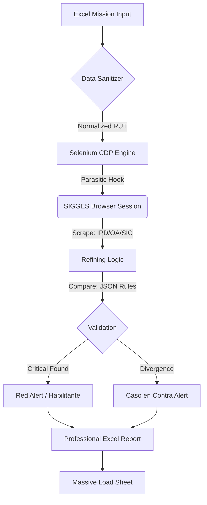

# 🩺 NOZHGESS: Clinical-Grade Automation & Forensic Audit Platform v3.5.0
> **"Robustness over Speed. Truth over Assumption. Evidence over Opinion."**

Nozhgess is a **high-precision software agent** designed for the clinical environment. It automates the verification of GES (Explicit Health Guarantees) by executing forensic scraping on SIGGES, identifying diagnostic disparities, and generating validated clinical reports with 100% auditability.

---

## 🚀 Hyper-Capabilities & Nuclear Features

### 1. Hybrid Session Parasitism (CDP Protocol)
Unlike standard bots, Nozhgess operates via **Session Parasitism**.
- **The Hook:** Connects directly to a running Microsoft Edge instance via the **Chrome DevTools Protocol (CDP)** on port `9222`.
- **Security Bypass:** It inherits the user's active session, NTML certificates, and security tokens, allowing it to navigate SIGGES without secondary authentication prompts.

### 2. Forensic Logic Engine (Execution Engine v3.5)
The internal brain (`Conexiones.py`) implements a clinical decision tree:
- **Smart Selection:** Algorithms that prioritize "Active" cases and utilizeRecency scoring to discard obsolete data.
- **Caso en Contra (Contra-Case Logic):** Automatically detects if a patient is misfiled (e.g., Type 1 Diabetes in a Type 2 list) and executes a recursive audit of the divergent case.
- **V2 Frequency Validation:** A delta-based temporal engine that calculates months/years since last procedures, ensuring compliance with clinical protocols.

### 3. Industrial-Grade GUI
Built on **CustomTkinter**, the UI is designed for high-density information environments.
- **Optimized Log Search:** A dual-highlighting (Yellow/Orange) search engine capable of handling 5,000+ log lines without UI lag.
- **Async Execution:** Full multithreading bridge using a producer-consumer pattern (`queue.Queue`) to keep the interface responsive during heavy IO operations.

---

## 🏗️ System Visualizer (High-Level Architecture)

---

## 🛠️ Technical Stack & Rationale

| Layer | Technology | Rationale |
| :--- | :--- | :--- |
| **Core** | Python 3.12 | Stability, rich library ecosystem, and native threading. |
| **Automation** | Selenium + CDP | Direct browser control without the need for standalone drivers. |
| **GUI** | CustomTkinter | Premium aesthetics and native Windows performance. |
| **Data** | Openpyxl | Robust handling of complex Excel styling and formulas. |
| **Boot** | PowerShell Core | Seamless integration with Windows process management. |

---

## 📂 Project Landscapes (Knowledge Base)

The project is extensively documented to ensure a **5-minute repair time**:

1.  [📘 **Operational Guide**](./Documentacion/GUIA_OPERATIVA_MAESTRA.md): User-focused step-by-step.
2.  [📙 **Technical Bible**](./Documentacion/BIBLIA_TECNICA_NOZHGESS.md): Low-level logic, threading, and Mermaid flows.
3.  [🛠️ **Backend Deep Dive**](./Documentacion/DOCUMENTACION_BACKEND_DEEP_DIVE.md): Scraper orchestration and error masks.
4.  [🖥️ **Frontend Deep Dive**](./Documentacion/DOCUMENTACION_FRONTEND_PROFUNDA.md): UI performance and buffering details.
5.  [🗺️ **Data Mapping**](./Documentacion/DOCUMENTACION_MAPA_DE_DATOS.md): XPath references and CSS Drift protocols.
6.  [⚙️ **Configuration Guide**](./Documentacion/GUIA_CONFIGURACION_MISIONES.md): Mission JSON dictionary.
7.  [📕 **Error Dictionary**](./Documentacion/DICCIONARIO_ERRORES_SOLUCIONES.md): Master list of failures and N3 solutions.

---

## 🛤️ Roadmap & Future Vision

- [ ] **v4.0:** Integration of Local LLMs for intelligent observation analysis.
- [ ] **v4.1:** Multi-tab parallel processing for 3x speed improvement.
- [ ] **v4.2:** Automated XPath Self-Healing using visual recognition fallback.

---

**© 2026 Nozhgess Foundation**
*Bridging Clinical Excellence and Engineering Precision.*
