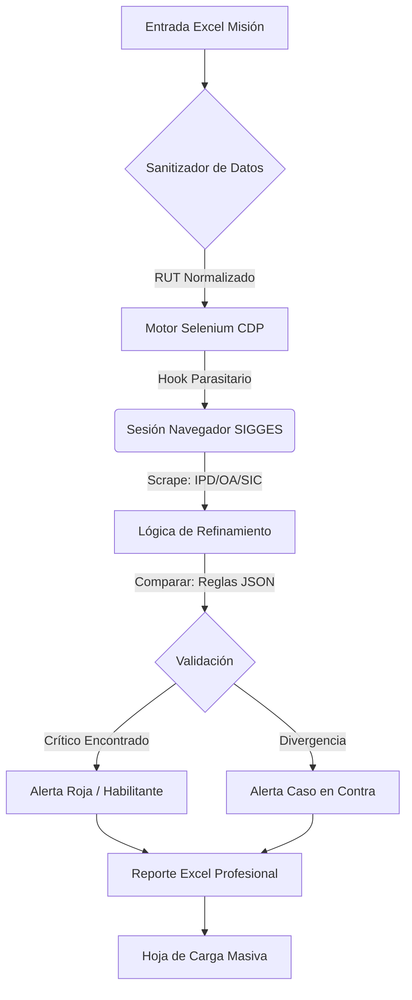

# 🩺 NOZHGESS: Plataforma de Automatización Clínica y Auditoría Forense v3.5.1
> **"Robustez sobre Velocidad. Verdad sobre Suposición. Evidencia sobre Opinión."**

Nozhgess es un **agente de software de alta precisión** diseñado para el entorno clínico. Automatiza la verificación de Garantías Explícitas en Salud (GES) mediante la ejecución de scraping forense en SIGGES, identificando disparidades diagnósticas y generando reportes clínicos validados con un 100% de auditabilidad.

---

## 🚀 Súper-Capacidades y Funciones Nucleares

### 1. Parasitismo de Sesión Híbrido (Protocolo CDP)
A diferencia de los bots estándar, Nozhgess opera mediante **Parasitismo de Sesión**.
- **El Gancho:** Se conecta directamente a una instancia de Microsoft Edge en ejecución mediante el **Chrome DevTools Protocol (CDP)** en el puerto `9222`.
- **Bypass de Seguridad:** Hereda la sesión activa del usuario, certificados NTML y tokens de seguridad, permitiendo navegar SIGGES sin solicitudes de autenticación secundarias.

### 2. Motor de Lógica Forense (Execution Engine v3.5.1)
El cerebro interno (`Conexiones.py` e `integrator.py`) implementa un árbol de decisión clínico:
- **Selección Inteligente:** Algoritmos que priorizan casos "Activos" y utilizan puntuación de recencia para descartar datos obsoletos.
- **Lógica de Caso en Contra:** Detecta automáticamente si un paciente está mal ingresado (ej. Diabetes Tipo 1 en una lista de Tipo 2) y ejecuta una auditoría recursiva del caso divergente.
- **Validación de Frecuencias V2:** Un motor temporal basado en deltas que calcula meses/años desde los últimos procedimientos, asegurando el cumplimiento de protocolos clínicos.
- **Motor de Columnas Dinámicas (v3.5.1):** Generación automática de estructuras de reporte basada en la configuración de la misión, eliminando columnas vacías y adaptándose a cualquier protocolo clínico.
- **Integrador Avanzado:** Nuevo sistema que unifica validaciones de RUT, fechas y nombres con optimización de memoria para grandes volúmenes de datos.
- **Auditoría Forense Granular:** Rastreo de cada decisión lógica (Objetivos, Habilitantes, Excluyentes) con trazabilidad de fechas y eventos, asegurando que ningún descarte sea "caja negra".

### 3. Interfaz de Grado Industrial
Construida sobre **CustomTkinter**, la interfaz está diseñada para entornos de alta densidad de información.
- **Búsqueda de Logs Optimizada:** Motor de búsqueda con resaltado dual (Amarillo/Naranja) capaz de manejar más de 5,000 líneas de log sin lag.
- **Ejecución Asíncrona:** Puente multihilo total utilizando un patrón productor-consumidor (`queue.Queue`) para mantener la interfaz sensible durante operaciones pesadas de E/S.

---

## 🏗️ Visualizador del Sistema (Arquitectura de Alto Nivel)

---

## 🛠️ Stack Técnico y Racional

| Capa | Tecnología | Racional |
| :--- | :--- | :--- |
| **Núcleo** | Python 3.12 | Estabilidad, ecosistema rico y multihilo nativo. |
| **Automatización** | Selenium + CDP | Control directo del navegador sin necesidad de drivers independientes. |
| **IU** | CustomTkinter | Estética premium y rendimiento nativo en Windows. |
| **Datos** | Openpyxl / Pandas | Manejo robusto de estilos Excel complejos, fórmulas y optimización de memoria. |
| **Arranque** | PowerShell Core | Integración perfecta con la gestión de procesos de Windows. |

---

## 📂 Paisajes del Proyecto (Base de Conocimiento)

El proyecto está extensamente documentado para garantizar un **tiempo de reparación de 5 minutos**:

1.  [📘 **Guía Operativa**](./Documentacion/GUIA_OPERATIVA_MAESTRA.md): Paso a paso enfocado al usuario.
2.  [📜 **Biblia Técnica**](./Documentacion/BIBLIA_TECNICA_NOZHGESS.md): Lógica de bajo nivel, hilos y flujos Mermaid.
3.  [🛠️ **Deep Dive Backend**](./Documentacion/DOCUMENTACION_BACKEND_DEEP_DIVE.md): Orquestación del scraper y máscaras de error.
4.  [🖥️ **Deep Dive Frontend**](./Documentacion/DOCUMENTACION_FRONTEND_PROFUNDA.md): Rendimiento de IU y detalles de buffering.
5.  [🗺️ **Mapa de Datos**](./Documentacion/DOCUMENTACION_MAPA_DE_DATOS.md): Referencias XPath y protocolos CSS Drift.
6.  [⚙️ **Guía de Configuración**](./Documentacion/GUIA_CONFIGURACION_MISIONES.md): Diccionario JSON de misiones.
7.  [📕 **Diccionario de Errores**](./Documentacion/DICCIONARIO_ERRORES_SOLUCIONES.md): Lista maestra de fallos y soluciones N3.

---

## 🛤️ Hoja de Ruta y Visión Futura

- [x] **v3.5.1:** Limpieza de infraestructura y actualización de documentación maestra.
- [ ] **v4.0:** Integración de LLMs locales para análisis inteligente de observaciones.
- [ ] **v4.1:** Procesamiento paralelo multi-pestaña para una mejora de velocidad de 3x.
- [ ] **v4.2:** Auto-reparación de XPath mediante fallback de reconocimiento visual.

---

**© 2026 Nozhgess Foundation**
*Uniendo la Excelencia Clínica con la Precisión de la Ingeniería.*
